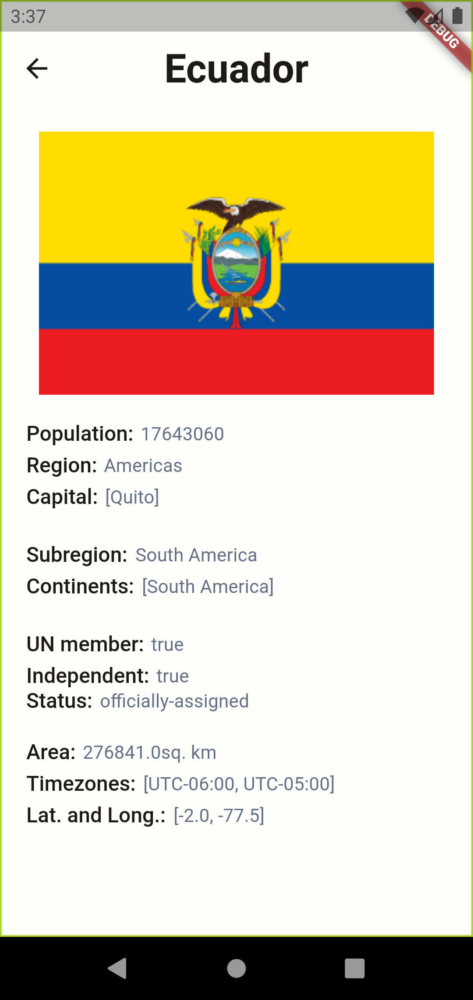

# countries_app

A simple mobile app that fetches data from the [**RestCoutries**](https://restcountries.com) rest [API](https://restcountries.com/v3.1/all) to display different datas about each the countries of the world.

## Code 💻

The codebase follows the layered architecture folder structure which is as below,

```
lib
├── core
│   ├── colors
│   └── styles
├── data
│   └── rest_countries_api
│       └── models
├── views
└── widgets
```
The `views` folder contains the different pages in the app, and the `widgets` contains the diffenrent shared `Widgets` and components used in the app, which makes it easy to add new screens. 

In the `core` folder we have the different configurations used throught the lifecycle of the app. 

The state management used for this is the [flutter_riverpod](https://riverpod.dev) which is a reactive databinding and state mangement library in [flutter](https://flutter.dev)


## UI design 🎨

The UI design follows the given [design](https://www.figma.com/file/v9AXj4VZNnx26fTthrPbhX/Explore?t=eZh6VKSTgix6yiNJ-0) in the task 

### Screenshots
|Home Page (Light mode)|Detail Page (light mode)|
|---|---|
||| 
|Home Page (Dark mode)|Detail Page (Dark mode)|
||| 

## Features
- Automatic dark and light modes based on the system theme of the device.
- List of countries and the details of each of them showing important informations about them.

### Prospective features
- Reactive country search.
- Reactive filter of countries by name, continents, regions,etc.


## Libraries and Plugins 🔌
A brief description of the libraries used.

|Name | Version | Use|
|---|---|---|
|[flutter_riverpod](https://pub.dev/packages/flutter_riverpod)| ^2.1.1| For launching urls |
|[equatable](https://pub.dev/packages/equatable)| ^2.0.5 | For classes `equality` operations|
|[http](https://pub.dev/packages/http)| ^0.13.5 | For performing `http` operations|


## Installation 🔨

To install the app on your computer, make sure you have [Flutter](https://flutter.dev) installed on your computer and clone this repository with

```sh
git clone https://github.com/Abdulrasheed1729/countries_app.git
```
the run 
```sh
flutter pub get
```
to get the packages, then the following to run the app
```
flutter run
```

Or you can check the appetize link below to see the demo of the app right in your browser.

## Appetize Link 🔗

[Link to the appetize demo](https://appetize.io/app/xztfn7fyjk7jrmz7nzkw6wrwn4?device=pixel4&osVersion=11.0&scale=75)
## Release

[Link to apk file](https://drive.google.com/drive/folders/1ch-3YZ14UPFukr7dv7hh4VBOlQ9l6xTY?usp=sharing)


<!-- ## Getting Started

This project is a starting point for a Flutter application.

A few resources to get you started if this is your first Flutter project:

- [Lab: Write your first Flutter app](https://docs.flutter.dev/get-started/codelab)
- [Cookbook: Useful Flutter samples](https://docs.flutter.dev/cookbook)

For help getting started with Flutter development, view the
[online documentation](https://docs.flutter.dev/), which offers tutorials,
samples, guidance on mobile development, and a full API reference. -->